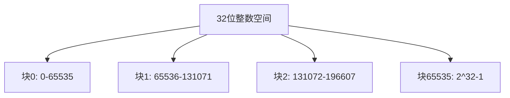
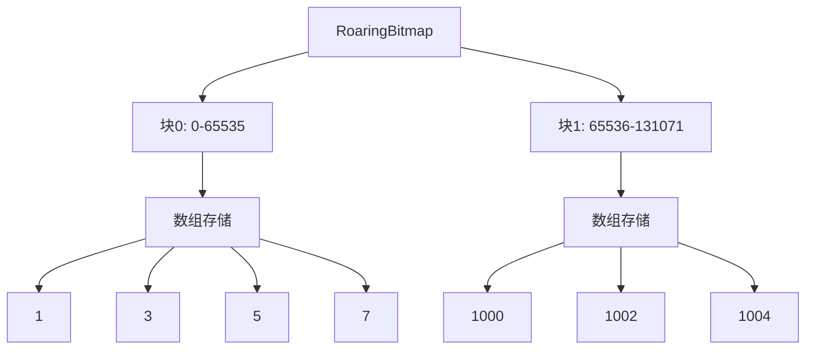
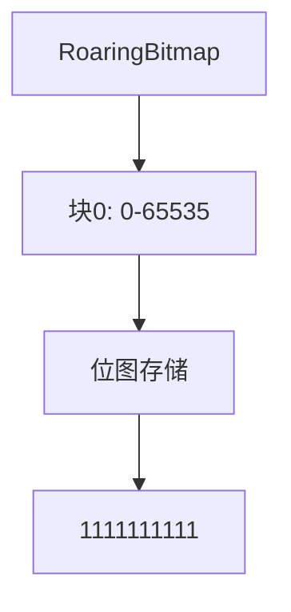
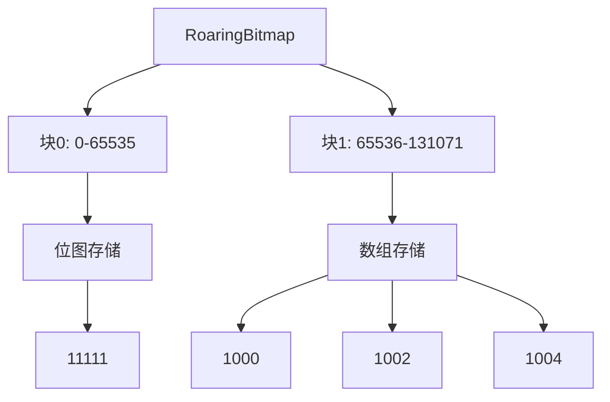
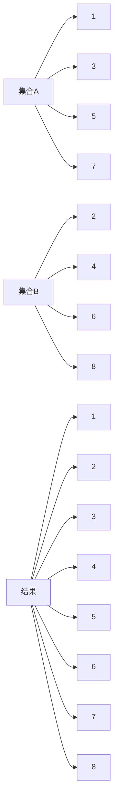
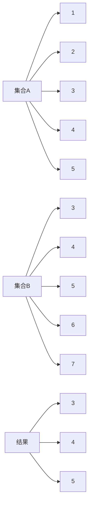
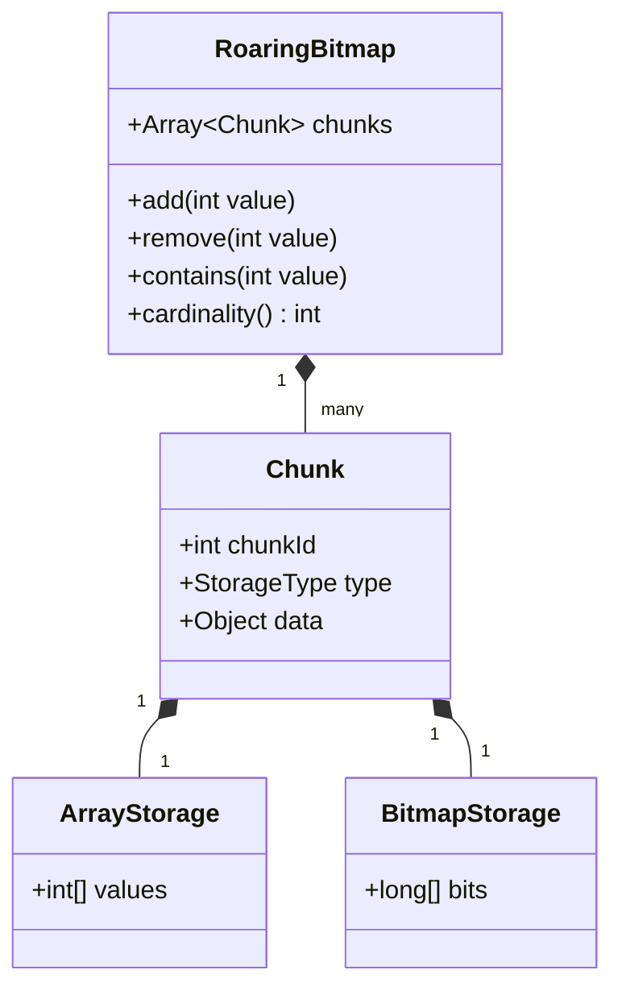
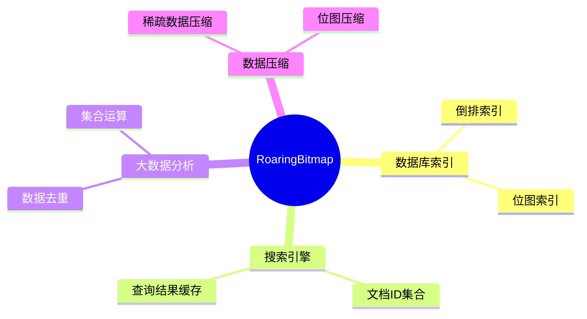

# RoaringBitmap Mermaid 图示

## 1. 基本结构

RoaringBitmap将32位整数空间（0到2^32-1）分成2^16个块，每个块处理65536个整数。这种分块设计是RoaringBitmap的核心思想，它允许根据数据特征为每个块选择最优的存储方式。



例如：
- 块0处理整数0到65535
- 块1处理整数65536到131071
- 以此类推...

## 2. 存储方式

### 2.1 稀疏数据存储

当某个块中的数据比较稀疏（数量较少）时，RoaringBitmap会使用数组来存储这些数据。数组存储方式适合存储少量数据，因为它的空间开销与数据量成正比。



在这个例子中：
- 块0存储了稀疏的整数[1,3,5,7]
- 块1存储了稀疏的整数[1000,1002,1004]
- 使用数组存储这些稀疏数据比使用位图更节省空间

### 2.2 密集数据存储

当某个块中的数据比较密集（数量较多）时，RoaringBitmap会使用位图来存储。位图存储方式适合存储大量连续或接近连续的数据，因为它的空间开销是固定的。



在这个例子中：
- 块0存储了连续的整数1到10
- 使用位图"1111111111"表示这些数据
- 每个1代表一个存在的整数，0代表不存在的整数

### 2.3 混合数据存储

RoaringBitmap的灵活性在于它可以为不同的块选择不同的存储方式，这取决于每个块中数据的特征。



在这个例子中：
- 块0使用位图存储连续的整数1到5
- 块1使用数组存储稀疏的整数[1000,1002,1004]
- 这种混合存储方式能够根据数据特征优化存储空间

## 3. 操作示例

### 3.1 并集操作

并集操作将两个集合中的所有元素合并成一个新的集合，去除重复元素。



操作过程：
1. 遍历两个集合的所有块
2. 对每个块执行位运算或数组合并
3. 生成包含所有元素的新集合

### 3.2 交集操作

交集操作找出两个集合中共同存在的元素。



操作过程：
1. 遍历两个集合的所有块
2. 对每个块执行位运算或数组交集
3. 生成只包含共同元素的新集合

## 4. 内存布局

RoaringBitmap的内部结构由多个类组成，每个类负责特定的功能。



类说明：
- `RoaringBitmap`：主类，管理所有数据块
- `Chunk`：表示一个数据块，包含块ID和存储类型
- `ArrayStorage`：数组存储实现
- `BitmapStorage`：位图存储实现

## 5. 性能对比

RoaringBitmap相比传统位图在空间效率和查询效率上都有优势。

```mermaid
graph TD
    A[存储方式对比] --> B[传统位图]
    A --> C[RoaringBitmap]
    
    B --> D[固定大小: 512MB]
    B --> E[查询: O(1)]
    
    C --> F[动态大小: ~1MB]
    C --> G[查询: O(1)块查找 + O(1)位运算]
```

性能特点：
1. 空间效率：
   - 传统位图：固定需要512MB（2^32位）
   - RoaringBitmap：根据数据特征动态分配，通常只需要几MB
2. 查询效率：
   - 传统位图：直接位运算，O(1)时间复杂度
   - RoaringBitmap：需要先查找块，再进行位运算，但仍然是接近O(1)的时间复杂度

## 6. 应用场景

RoaringBitmap在多个领域都有广泛应用。



应用场景说明：
1. 数据库索引：
   - 倒排索引：存储文档ID集合
   - 位图索引：快速过滤和查询
2. 搜索引擎：
   - 存储文档ID集合
   - 缓存查询结果
3. 大数据分析：
   - 数据去重
   - 高效集合运算
4. 数据压缩：
   - 压缩稀疏数据
   - 压缩位图数据 